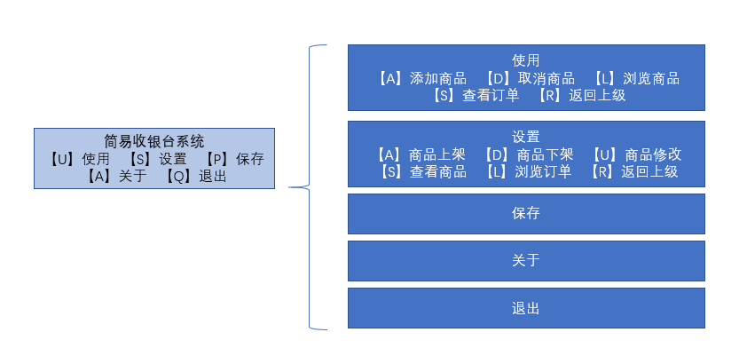

## 项目名称

简易收银台系统

## 项目描述

基于字符界面的简易收银台系统，支持使用收银台【U】实现买单功能，设置收银台【S】实现商品上架、下架等功能。

## 使用技术

+ Java基础

+ 采用Java序列化技术，将信息保存在文件中

## 项目功能

+ 使用

【A】添加商品 【D】取消商品 【L】浏览商品 【S】查看订单 【R】返回上级

+ 设置

【A】商品上架 【D】商品下架 【U】商品修改 【S】查看商品 【L】浏览订单 【R】返回上级

+ 保存

+ 关于

+ 退出

## 项目实现

因为该收银台的使用和设置功能里都包含了商品和订单两个信息，基于Java的面向对象编程，我们可以将商品和订单分别抽象为一个类，再设置一个商品中心和订单中心分别来管理商品和订单。

由于数组一旦定义好，就不能再改变，所以本系统中使用Map结构来存储商品信息和订单信息。

退出本系统前，我们可以采用File将所有信息保存在文件中，保存完后文件将被持久化，程序退出后，数据依然在文件里，却不在内存中，所以在下次使用本系统前，我们需要重新加载所有数据。

启动本系统后，我们还需要实现交互，按照提示输入字符，实现相应的功能。

## 优化与扩展

+ 优化

目前只是将商品信息和订单信息保存在了文件里，后面还可以尝试使用JDBC技术将这两者保存在数据库里。

+ 扩展

这只是一个最简单的收银台系统，可以尝试将其扩展为可以多个人同时收银。

## 项目总结

+ 熟悉项目的开发流程（需求，分析，技术选择，设计，编码，测试，发布）
+ 掌握了Java基础中常见的类、接口的使用
+ 熟练使用Java序列化技术将信息保存在文件中
+ 加深了对maven工具的理解和掌握